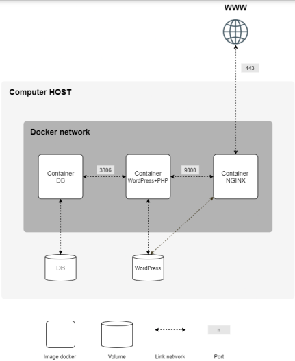

# Inception

Inception is a rank 5 project in the 42 courses where the main objective consists of having you set up a small infrastructure composed of different services under specific rules, using Docker.  

### What is Docker ?  
Docker is an open-source platform that allows you to create, deploy, and manage applications in containers. [Containers](https://www.docker.com/resources/what-container/) are isolated environments that contain everything a software application needs to run, including code, libraries, and dependencies, ensuring it works consistently across any system. [Docker beginner guide here](https://medium.com/@JeffyJeff/the-beginners-guide-to-docker-fa4c4d3181e7)


### What services do we use?

When creating the [image](https://docs.docker.com/get-started/docker-concepts/the-basics/what-is-an-image/) for each service, each of them must be based on an old stable version of Debian or Alpine.  

The services we have created are:  
- A **MariaDB** database  
- **WordPress + PHP-FPM**  
- An **Nginx** server  

The infrastructure will look like this:

<!-- Code to show the image in the center-->
<br>
<p align="center">
  
</p>
<br>

## 🚀 Installation  
To start the project, we need Docker. If you don’t have it, visit this [repository with a script to install Docker](https://github.com/andrexandre/script).  

If you already have it, just follow the next instructions.  

### Clone this repository:  
```bash
git clone https://github.com/mouracv/Inception
cd Inception
```

## ⚙️ Configuração
Before launching the containers, we need to create a **.env** file inside the **srcs** folder, where we store all the necessary configurations for the containers.  

Create the **.env** file:  
```bash
touch srcs/.env
```

Then, add the following variables inside the **.env** file:
```bash
DB_NAME=my_database           # Name of the MariaDB database
DB_USER=my_user               # Database username
DB_PASSWORD=my_password       # Database user password
DB_ROOT_PASS=root_password    # Root user password for the database
DB_HOST=mariadb               # Don´neet to change this one
WP_ADMIN_USER=admin           # WordPress admin username
WP_ADMIN_PASS=admin_password  # WordPress admin password
WP_ADMIN_EMAIL=admin@example.com  # WordPress admin email
WP_TITLE="My WordPress Site"  # Title of the WordPress site
WP_SIMPLE_USER=user           # Regular WordPress user username
WP_SIMPLE_PASS=user_password  # Regular WordPress user password
WP_SIMPLE_EMAIL=user@example.com  # Regular WordPress user email

DOMAIN=mywebsite.com          # Website domain (e.g., "example.com")
```

And the final step to configure is to change the hostname so that you can access the website using the Domain you choose. To do that, we need to modify a file with sudo permissions.  
```bash
sudo nano /etc/hosts
# Then, add this: 127.0.0.1 [TAB] The Domain you choose
```

## 🛠 Usage  

Now we are ready to run the project. To launch the containers, just run this command in the root of the repository:
```bash
make build-volume && make build-up
```
And now open your browser and serch for you ***Domain*** and see the website

## 👨‍💻 Autor
- [GitHub](https://github.com/mouracv)
- [Linkedin](https://www.linkedin.com/in/alexsandro-moreira-2b438a347/)